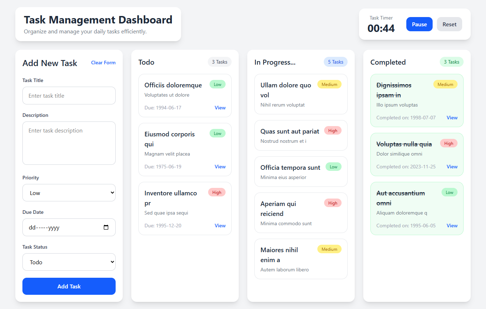

# Task Management Dashboard

A responsive React task management dashboard for organizing daily work in one clear view. Create tasks with descriptions, priorities, due dates, and statuses, then review them across Todo, In Progress, and Completed columns. The dashboard also includes a built-in task timer for tracking focused work sessions.



## Features

- Create tasks with a title, description, priority, due date, and status.
- Display tasks in status-based columns:
	- Todo
	- In Progress
	- Completed
- Show task counts for each workflow column.
- Use priority labels to distinguish Low, Medium, and High priority work.
- Start, pause, and reset the built-in task timer.
- View task due dates and descriptions at a glance.
- Responsive layout that adapts from mobile screens to larger desktop displays.
- Tailwind CSS styling with reusable React components.

## Tech Stack

- React 19
- React DOM 19
- Vite
- Tailwind CSS 4
- `@tailwindcss/vite`
- ESLint

## Getting Started

### Prerequisites

Make sure Node.js and npm are installed on your machine.

### Installation

1. Clone the repository and move into the project directory.

```bash
git clone <repository-url>
cd Task-Management-Dashboard
```

2. Install the project dependencies.

```bash
npm install
```

3. Start the development server.

```bash
npm run dev
```

Vite will provide a local URL in the terminal, usually `http://localhost:5173`.

## Usage

1. Enter a task title and description in the Add New Task form.
2. Select a priority, due date, and task status.
3. Select **Add Task** to add the task to the matching dashboard column.
4. Use **Clear Form** to remove the current form values.
5. Use the timer's **Start** button to begin tracking time. The button changes to **Pause** while the timer is running.
6. Select **Reset** to stop the timer and return it to `00:00`.

## Available Scripts

| Command | Description |
| --- | --- |
| `npm run dev` | Start the Vite development server. |
| `npm run build` | Create an optimized production build. |
| `npm run preview` | Preview the production build locally. |
| `npm run lint` | Run ESLint across the project. |

## Project Structure

```text
.
├── public/
│   └── screenshots/
│       └── screenshot-home.png
├── src/
│   ├── assets/
│   ├── components/
│   │   ├── Completed.jsx
│   │   ├── Dashboard.jsx
│   │   ├── Form.jsx
│   │   ├── Header.jsx
│   │   ├── Inprogress.jsx
│   │   ├── Timer.jsx
│   │   └── Todo.jsx
│   ├── App.jsx
│   ├── index.css
│   └── main.jsx
├── index.html
├── package.json
└── vite.config.js
```

## Current Data Behavior

Tasks are held in React component state while the application is running. They are not currently persisted to a database, local storage, or an external API, so refreshing the page clears the task list. The timer state is also reset when the page is refreshed.

## Future Improvements

- Persist tasks with local storage or a backend API.
- Add task editing and deletion.
- Add drag-and-drop movement between status columns.
- Add filtering and sorting by priority or due date.
- Associate the timer with a selected task.
- Add automated tests for task creation and timer behavior.

## Contact

**Philips Ola**  
Full-Stack Developer

- Portfolio: [olaphilips.com.ng](https://olaphilips.com.ng)
- YouTube: [IDTechnol](https://youtube.com/idtechnol)
- LinkedIn: [linkedin.com/in/olaphilips](https://linkedin.com/in/olaphilips/)

## License

This project is currently provided for learning and demonstration purposes.
